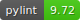

# pycvcqv

<div align="center">

[](https://github.com/MaaniBeigy/pycvcqv/actions?query=workflow%3Abuild)
[](https://github.com/MaaniBeigy/pycvcqv)
[](https://github.com/MaaniBeigy/pycvcqv)
[](https://pypi.org/project/pycvcqv/)
[](https://github.com/MaaniBeigy/pycvcqv/pulls?utf8=%E2%9C%93&q=is%3Apr%20author%3Aapp%2Fdependabot)

[](https://github.com/psf/black)
[](https://github.com/PyCQA/bandit)
[](https://github.com/MaaniBeigy/pycvcqv/blob/master/.pre-commit-config.yaml)
[](https://github.com/MaaniBeigy/pycvcqv/releases)
[](https://github.com/MaaniBeigy/pycvcqv/blob/master/LICENSE)

:construction: WIP   
Coefficient of Variation (CV) and Coefficient of Quartile Variation (CQV) with Confidence Intervals (CI)   
Python port of [cvcqv](https://github.com/MaaniBeigy/cvcqv)

</div>

### Testing:  

```bash
make install
make test && make coverage && make check-codestyle && make mypy && make check-safety
```

### Pylint Badge:  

```bash
. .venv/bin/activate
pylint pycvcqv -> pylint-log.txt
lintscore=$(grep 'rated at' pylint-log.txt | cut -d\   -f10 | cut -d \/ -f 1)
pip3 install anybadge
anybadge -o --value=$lintscore --file=assets/images/pylint.svg pylint
```


### Upload initial code to GitHub:

```bash
git add .
git commit -m ":tada: Initial commit"
git push -u origin main
```


## Credits [](https://github.com/TezRomacH/python-package-template)

This project was generated with [`python-package-template`](https://github.com/TezRomacH/python-package-template)
